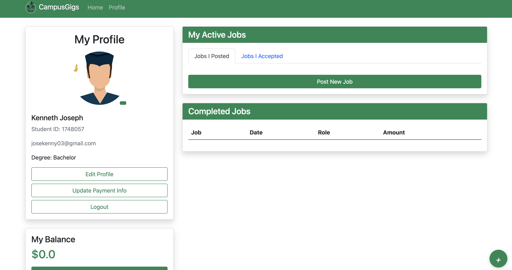
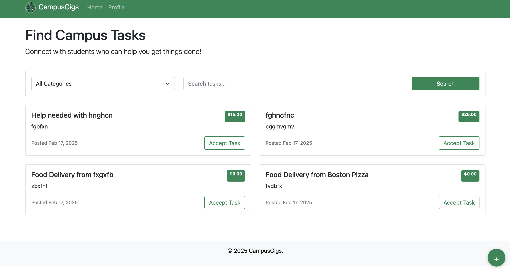

# CampusGigs - Student Gig Marketplace 🎓
CampusGigs is a **student-run job posting platform** where students can **post, accept, and complete short-term gigs** within their university. It fosters a **free-market system** for on-campus jobs like food delivery, academic help, and creative work.

## Tech - Stack 💻 📀
- **MongoDB Atlas** – Hosted database for scalable storage.
- **Flask & PyMongo** – Backend framework and database communication.
- **FuzzyBuzzy Search** – Advanced search functionality.
- **HTML, CSS, JS & Bootstrap** – Responsive front-end design.

## ✨ Features (Some have yet to be implemented) 
- 🔍 **Find on-campus gigs** (food delivery, tutoring, creative work).
- 💰 **Flexible pricing** – students set their own rates.
- 🏫 **Student-only network** – verified student registration.
- 🔄 **Real-time job updates** – automatic job status tracking.
- 🔐 **Secure payment system** – escrow-based transactions.
- 🏷 **Fuzzy search with FuzzyBuzzy** – quickly find relevant jobs.

## 📸 Screenshots
Here are some previews of CampusGigs:




## 🛠 Installation & Setup
### 1️⃣ Clone the Repository
```sh
git clone https://github.com/yourusername/CampusGigs.git
cd CampusGigs
```

### 2️⃣ Install MongoDB
#### **MacOS (Homebrew)**
```sh
brew tap mongodb/brew
brew install mongodb-community@7.0
brew services start mongodb-community@7.0
```

#### **Windows (Chocolatey)**
```sh
choco install mongodb-community --version=7.0
net start mongodb
mongod --dbpath "C:\data\db"
sc config mongodb start=auto
```

#### **Windows (Winget)**
```sh
winget install MongoDB.Server --version 7.0
net start MongoDB
```

### 3️⃣ Install Dependencies & Run Flask Server
```sh
pip3 install -r requirements.txt
python3 -m flask run
```

### 4️⃣ Open CampusGigs in Your Browser
```
http://localhost:5000
```


📌 **Note**: Ensure you have **Flask running** before testing the API.

## 🤝 Contributing
We welcome contributions! To contribute:
1. **Fork** this repository.
2. **Clone** your forked repository:
   ```sh
   git clone https://github.com/yourusername/CampusGigs.git
   ```
3. **Create a new feature branch**:
   ```sh
   git checkout -b feature-xyz
   ```
4. **Commit your changes** and **push** to your fork:
   ```sh
   git add .
   git commit -m "Add feature xyz"
   git push origin feature-xyz
   ```
5. **Open a pull request** 🚀

For major changes, please open an issue first to discuss your proposal.

## 📜 License

## 🔮 What's Next?
Here’s what’s coming soon in future updates:
- 🔐 **Student ID Verification** – Ensuring secure and authentic transactions.
- 📡 **AI-Powered Job Recommendations** – Smart matching based on user activity.
- 💳 **Multiple Payment Options** – Secure escrow-based transactions.
- 🎓 **Expand to More Campuses** – Grow the student network beyond a single university.
-  📸 **Photo verification** – prevents job disputes.


CampusGigs has the **potential to revolutionize student gig work**, and we’re excited to **continue building, refining, and expanding**. The journey doesn’t stop here—we’re just getting started! 🚀
